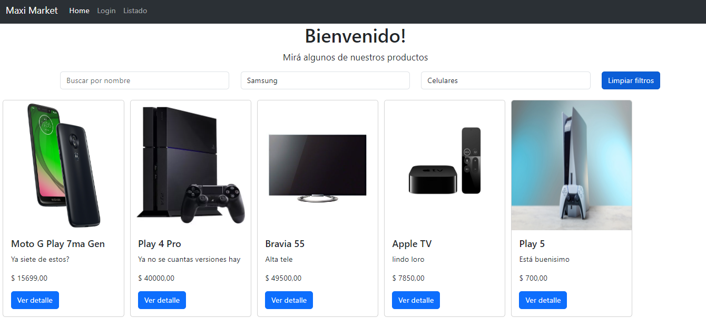
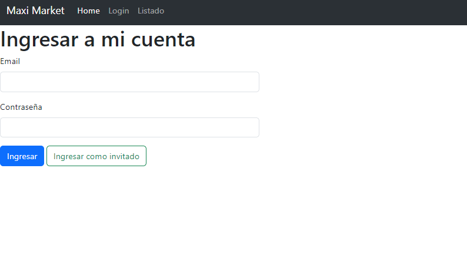
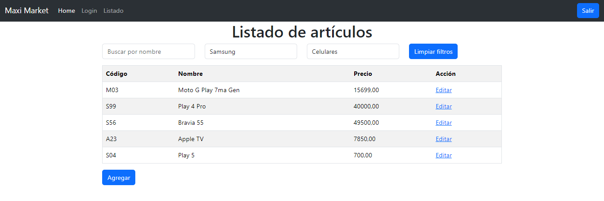

# Maxi Market 🏪

En esta aplicación web, podrás acceder a un catálogo de productos de un ECommerce, además de la opción de iniciar sesión para administrar los mismos. 

Esta aplicación posee:

* Un listado en forma de cartas de los productos. 📦
* Muchos filtros para encontrar el producto buscado. 📂
* Una pantalla de bienvenida. 🏡
* Una pantalla de Login con la opción de entrar como invitado. 👥
* Una tabla con todos los productos para administrarlos fácilmente. 💻
* Un diseño responsivo y limpio hecho en Bootstrap 5 🎨

## Tech Stack ⌨🖱

C# - ASP.NET - SQL Server - JS - Bootstrap

## Imágenes 🖼

